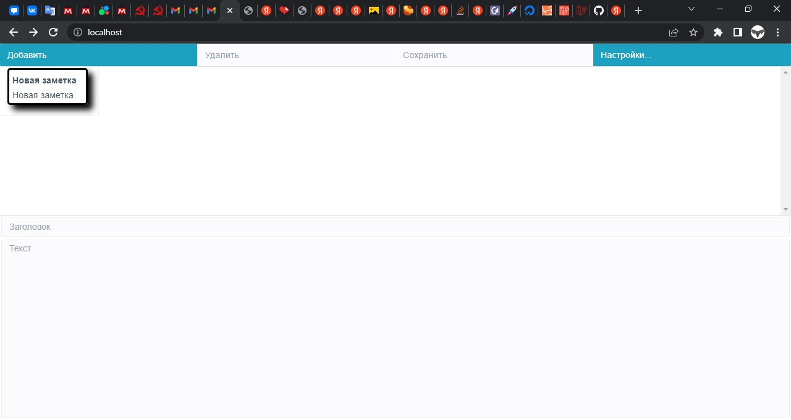
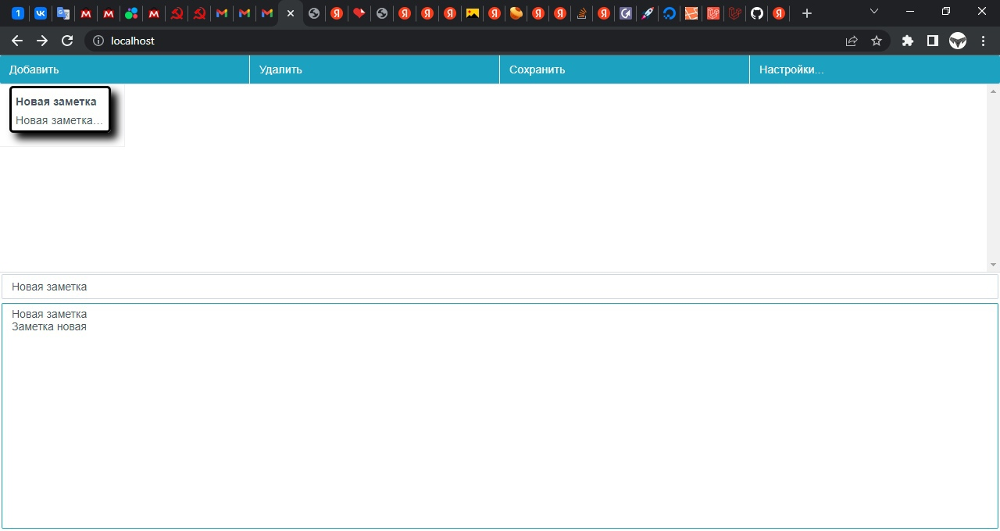
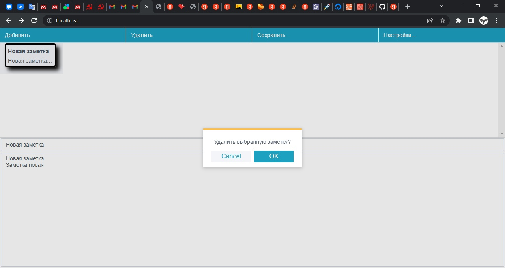
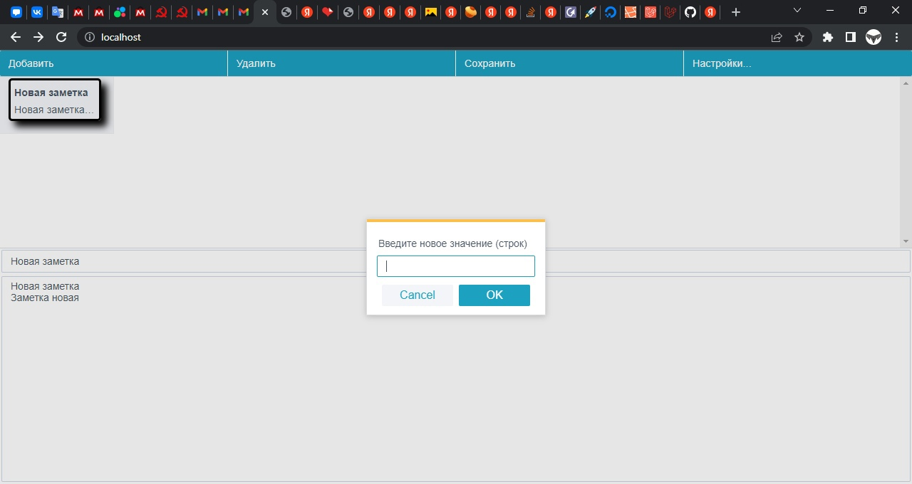
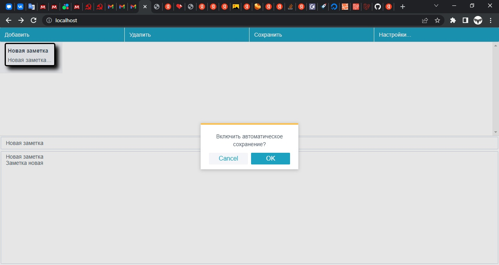
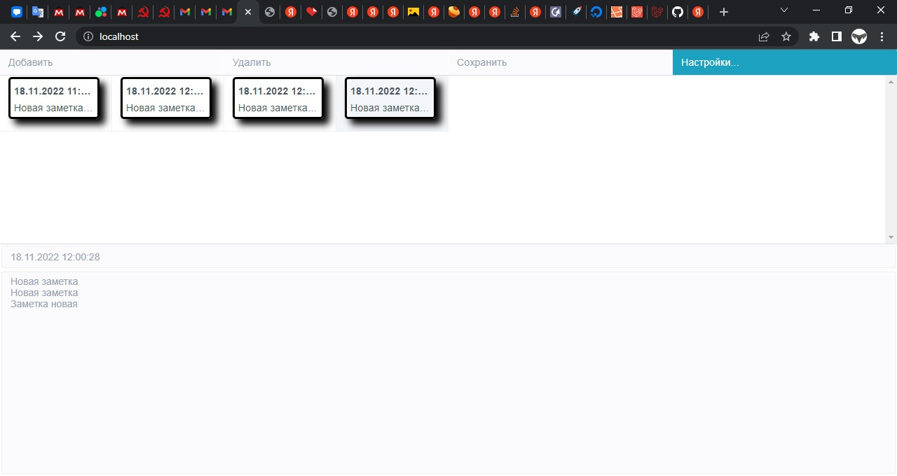

# WebNotes
 
 
 
 
 
 

## Установка
Меняй в .env

APP_NAME=[Название_сайта]

APP_DEBUG=[Выводить_ошибки?]

APP_URL=[Адрес_сайта]

Копируй базы данных

Меняй в .env

DB_HOST=[Название_хоста_сервера]

DB_DATABASE=[Название_базы_данных_на_сервере]

DB_USERNAME=[Логин_пользователя]

DB_PASSWORD=[Пароль_пользователя]
